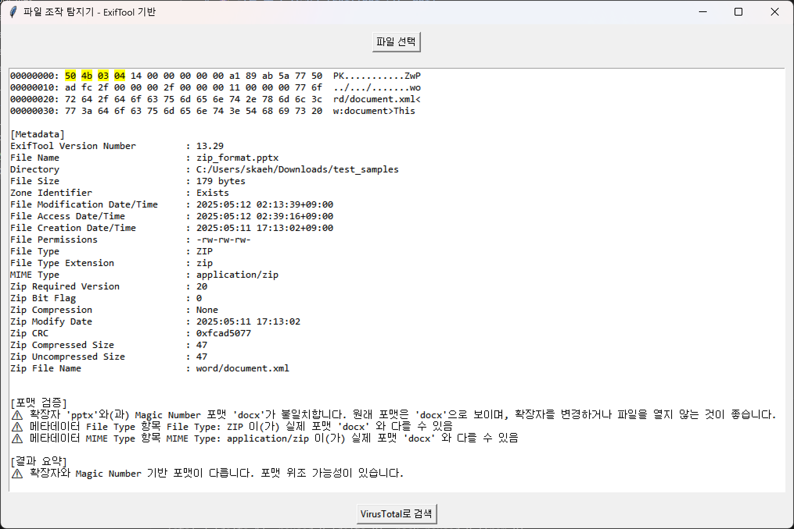
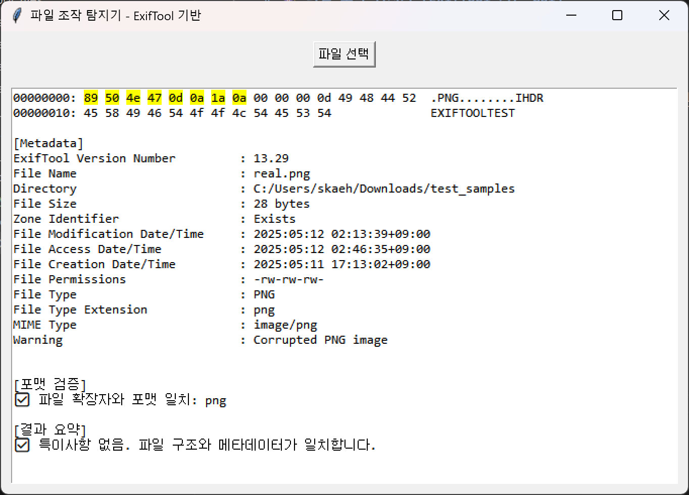

# 🕵️‍♀️ 파일 조작 탐지기 (ExifTool 기반 GUI)

**파일 조작 탐지기**는 다양한 파일 포맷의 **헤더 및 메타데이터 구조를 분석**하여 조작 여부를 식별하고, **포맷 위조 가능성**까지 감지할 수 있는 시각화 기반 GUI 툴입니다.  
초보 정보보안 학습자도 **클릭 몇 번만으로** 포맷 조작 여부를 쉽게 파악할 수 있습니다.


## ✅ 주요 기능

| 기능 항목                 | 설명                                                                 |
|--------------------------|----------------------------------------------------------------------|
| **Hex 헤더 분석**       | 파일 앞부분 64바이트를 추출하여 **16진수 + ASCII** 형태로 출력       |
| **Magic Number 포맷 식별** | 파일의 실제 포맷(PNG, JPG, EXE 등)을 **시그니처 기반으로 자동 감지** |
| **확장자 vs 포맷 불일치 감지** | 확장자와 magic number 기반 포맷이 다르면 **경고 출력**                |
| **메타데이터 분석 (ExifTool)** | 생성/수정 시간, MIME Type 등 파일 내부 메타정보 표시               |
| **포맷 위조 의심 요약**     | 포맷 구조와 메타데이터의 불일치 여부를 **요약 정리**                  |
| **VirusTotal 연동**       | 버튼 클릭만으로 해당 파일의 **해시 기반 악성 여부 확인 가능**        |


## 🧪 지원 포맷

- 이미지: `jpg`, `png`, `gif`  
- 문서: `pdf`, `hwp`, `doc`, `docx`, `txt`  
- 스프레드시트: `xls`, `xlsx`  
- 프레젠테이션: `ppt`, `pptx`  
- 실행파일: `exe`  
- 기타: ZIP 구조 기반 포맷 자동 감지 (`docx`, `pptx` 등)


## 💻 실행 방법

### 1. 시스템 요구사항
- Python 3.8 이상
- [ExifTool](https://exiftool.org/) 설치 필요

> **Windows 설치 방법**
> - `exiftool(-k).exe` 파일을 `exiftool.exe`로 이름 변경 후, 시스템 PATH에 등록하세요.

### 2. 설치 및 실행
```bash
git clone https://github.com/songyaeji/FAE_fileAnalysisExiftool
python fae.py
```


## 📂 프로젝트 구조
```bash
FAE_fileAnalysisExiftool/
├── fae.py              # 메인 GUI 코드
├── README.md            # 문서 파일
├── requirements.txt     # 설치 패키지 목록
└── test_samples/        # 위조 테스트 파일 모음 (선택사항)
```


## 📷 예시 스크린샷
#### ⚠️ 포맷 위조 감지


#### ✅ 정상 파일
